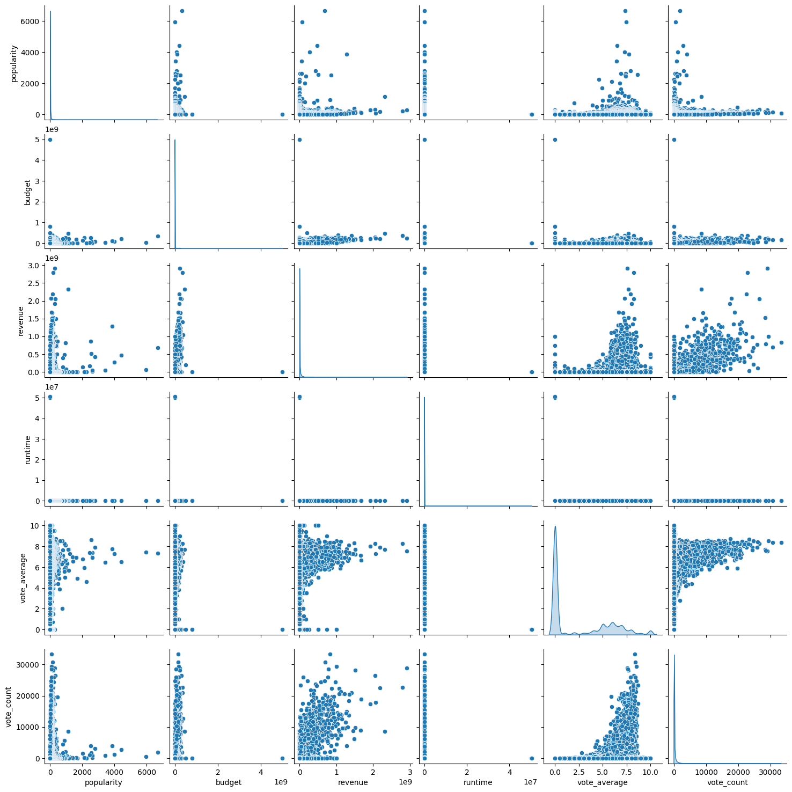
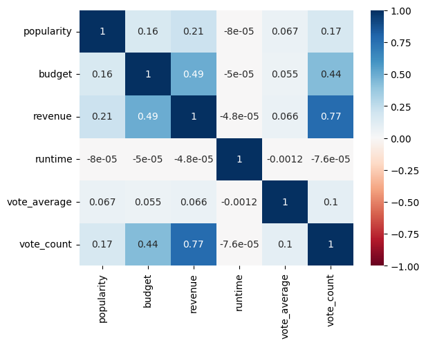
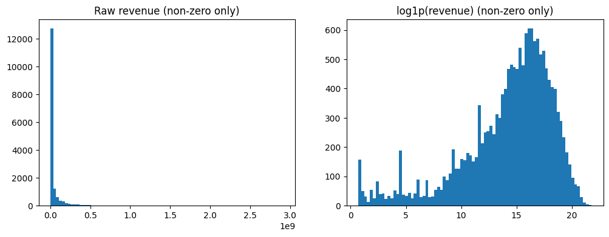
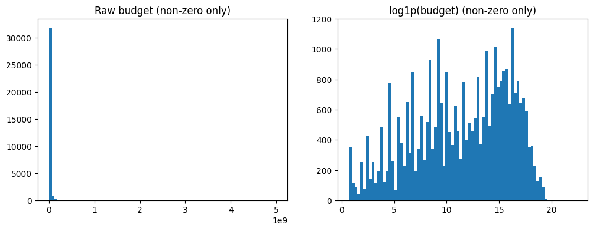
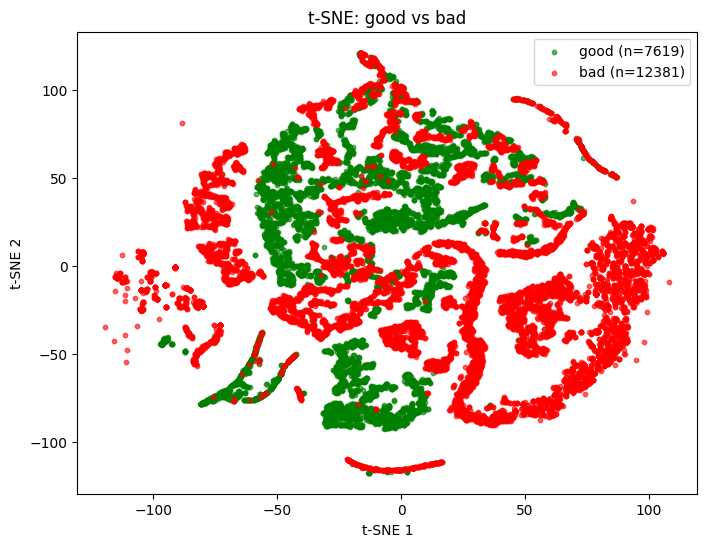

# Final Report
## 1  Introduction
Have you ever sat down to watch a movie and struggled to decide which one might actually be worth your time? This everyday dilemma reflects a much larger challenge in the film industry: predicting which movies will perform well and resonate with audiences. That's why we chose to use the [Wykonos Movies Dataset](https://huggingface.co/datasets/wykonos/movies) to develop a predictive model that predicts movie performance based on 20 attributes that ranged from financial measures like budget and revenue to cultural markers like genre and runtime. With over 700k movies in this dataset, the variety of films mirrors the real-world diversity of the film industry. 

Not only does predicting movie performance connect to a topic lots of people are passionate about, it also generates data-driven insights with practical value for the entertainment and media industries. For film studios and streaming platforms, predictive insights can guide decisions on how to target marketing and how to anticipate audience preferences based on the types of movies they make/sell. For audiences, this predictive model highlights the quantitative factors that influence success in a very subjective industry. On a smaller scale, this kind of model could help everyday viewers decide which movie is worth watching on a given night.

## 2 Figures
### List of Figures
- Figure 1: Pair plot to show distribution of movie attributes before preprocessing.
- Figure 2: Correlation matrix of dataset attributes.
- Figure 3: Distribution of raw movie revenues compared to log-transformed revenues.
- Figure 4: Distribution of raw movie budgets compared to log-transformed budgets.
- Figure 5: t-SNE visualization of 20,000 sampled movies projected into two dimensions
- Table 1: Classification report for KNN (K = 5)
  
## 3  Methods

### 3.1 Data Exploration
We began by exploring the movies dataset, which contains over 700,000 entries with both numerical and categorical attributes. Numerical attributes include runtime, budget, revenue, popularity, vote count, and release date. Categorical attributes include original language, status, genre, and overview. Initial exploration of this dataset involved plotting histograms and distributions to understand ranges and skewness and help us figure out how to address missing data (Figures 1 and 2). After exploring, we realized we had a lot of cleaning up to do, especially when it came to the skew in some of the attributes and missing data points.

<p align="center">
  
</p>
<p align="center"><em>Figure 1. Distribution of movie attributes before preprocessing.</em></p>


<p align="center">
  
</p>
<p align="center"><em>Figure 2. Correlation matrix of dataset attributes.</em></p>

### 3.2  Preprocessing
We began preprocessing by filtering the dataset to only include movies with ```status = "Released"```. Unrealeased/planned movies don't provide us much relevant information when training a model to predict how a movie will perform. From the full list of attributes, we kept the most relevant features for prediction: ```original_language```, ```popularity```, ```release_date```, ```budget```, ```revenue```, ```runtime```, ```vote_average```, and ```vote_count```. After feature selection, we prepared the dataset for modeling by:

1. Handling Missing Data
   - For categorical attributes, missing values were filled with placeholders like "other" for genre, "zz" for original_language.
   - For numerical attributes (popularity, budget, revenue, runtime, vote_average, vote_count) missing entries were filled with 0.
     
2. Feature Transformation
   - Applied a log transform (```log1p```) to skewed numerical features (budget, revenue, vote_count, popularity) to normalize their distributions. We generated histograms to compare raw and log-transformed distributions for budget and revenue (Figures 3 and 4).
   - Runtime values were clipped to a range between 5 and 300 minutes to remove impossible/unrealistic outliers, like so:

      ```python
     moviesFiltered["runtime"] = moviesFiltered["runtime"].clip(5, 300)

<p align="center">
  
</p>
<p align="center" ><em>Figure 3. Distribution of raw movie revenues (left) compared to log-transformed revenues (right). The log transformation reduces extreme skew, spreading the data more evenly and revealing a clearer structure.</em></p>

<p align="center">
  
</p>
<p align="center"><em>Figure 4. Distribution of raw movie budgets (left) compared to log-transformed budgets (right).</em></p>

4. Encoding Categorical Values
   - Genres were split into multiple categories and one-hot encoded using ```pandas.get_dummies```. Duplicate IDs were collapsed by taking the maximum value across duplicates, like so:

     ```python
     moviesFiltered = pd.get_dummies(moviesFiltered.explode('genres'), columns=['genres'], dtype=int).groupby('id').max()
   - Original language was reduced to the top 10 most frequent languages, with all others grouped into "zz", then one-hot encoded.
   - Release dates were converted into int years, with missing values filled as 0.
  
These preprocessing steps ensured that the data was consistent and normalized among all the attributes.


### 3.3  Model 1: Decision Trees, Random Forest Regressor
For our first predictive model, we implemented a Random Forest Regressor. The dataset was split into 80% training and 20% testing, with random shuffling (```random_state = 14```) applied before the split. Features were standardized so that numerical attributes had mean = 0 and standard deviation = 1.

The Random Forest was trained with the hyperparameters:
- n_estimators = 150
- max_depth = 12
- max_features = 0.5
- min_samples_leaf = 5
- bootstrap = True
- max_samples = 0.7

### 3.4  Unsupervised Learning: TSNE
Before building our second model, we applied **t-distributed Stochastic Neighbor Embedding (t-SNE)** to project the high-dimensional feature space into two dimensions for visualization. This allowed us to see whether clusters of “good” and “bad” movies (based on ```vote_average```) could be separated in a lower-dimensional space. 

20,000 movies were randomly selected from the dataset, and we applied TSNE with parameters:
- n_components=2,
- perplexity=30,
- learning_rate='auto',
- init='random',
- max_iter=1000,
- random_state=42,
- metric='euclidean',

The resulting 2D scatterplot (Figure 5) revealed local clustering patterns where “good” movies (```vote_average >= mean(vote_average)```) were labeled green and “bad” movies (```vote_average < mean(vote_average```) were labeled red. While the boundaries weren't perfectly separate, the visualization supported the idea that neighborhood-based models like KNN could be effective at capturing local structure in this dataset.

<p align="center">
  
</p>
<p align="center" ><em>Figure 5. t-SNE visualization of 20,000 sampled movies projected into two dimensions. Green points represent “good” movies and red points represent “bad” movies.</em></p>

### 3.5  Model 2: K-Nearest-Neighbors (KNN)
Based on the clustering patterns revealed in the t-SNE visualization, we implemented a K-Nearest Neighbors (KNN) regressor for our second model to test whether neighborhood-based predictions could outperform the global Random Forest model.

To prepare the data, we standardized all numerical features so they had a mean of zero and unit variance. The dataset was again split into an 80/20 train-test split, which was consistent with Model 1. Like model 1, we trained on the standardized training set and evaluated on the test set, but this time around we experimented with multiple values of K (the number of neighbors), specifically testing K = 2, K = 5, and K = 8.


## 4  Results
Model evaluation was performed on the test split using Mean Squared Error (MSE), Root Mean Squared Error (RMSE), R^2, and the percentage of predictions within +/- 1.0 of the true vote_average.

### 4.1  Model 1 Results
Test Results:
- Test MSE = 1.2107
- Test RMSE ≈ 1.1003
- Test R^2 = 0.8787
- +/- 1.0 accuracy = 82.83%

On the fitting curve, the Random Forest with depth 12 and minimum samples per leaf = 5 hit the “sweet spot.” Shallower forests (lower depth) tended to underfit, showing higher test error, while deeper forests lowered training error but began to overfit. This was a strong baseline, but we wanted to improve performance by clustering the dataset and using KNN within our clusters for our second model.

### 4.2  Model 2 Results
Test Results:
- K = 2: MSE = 1.424, RMSE = 1.1931, R^2 = 0.8545, +/- 1.0 accuracy = 84.68%
- K = 5: MSE = 1.334, RMSE = 1.1551, R^2 = 0.8636, +/- 1.0 accuracy = 83.73%
- K = 8: MSE = 1.385, RMSE = 1.1769, R^2 = 0.8585, +/- 1.0 accuracy = 81.90%

Between these K values, K = 5 provided the best balance. The K = 2 model tended to overfit by making predictions too sensitive to local noise while K = 8 underfit the data.

We also evaluated KNN as a classifier by converting the continuous target variable into binary classes (good” movies and “bad” movies) like we had in model 1. With K = 5, the classification results were strong, with overall accuracy of 95%. As shown in Table 1, precision, recall, and F1-scores were well balanced across both classes. This confirmed that the KNN approach was not only effective when predicting exact ratings but also in distinguishing between high- and low-quality films (good v. bad predictions).

**Table 1. Classification Report for KNN (K = 5)**

| Class | Precision | Recall | F1-Score | Support |
|-------|-----------|--------|----------|---------|
| Bad   | 0.97      | 0.95   | 0.96     | 2398    |
| Good  | 0.93      | 0.95   | 0.94     | 1602    |
| **Accuracy** |       |        | **0.95** | **4000** |
| **Macro Avg** | 0.95 | 0.95   | 0.95     | 4000    |
| **Weighted Avg** | 0.95 | 0.95 | 0.95   | 4000    |

## 5  Discussion
This is where you will discuss the why, and your interpretation and your though process from beginning to end. This will mimic the sections you have created in your methods section as well as new sections you feel you need to create. You can also discuss how believable your results are at each step. You can discuss any short comings. It's ok to criticize as this shows your intellectual merit, as to how you are thinking about things scientifically and how you are able to correctly scrutinize things and find short comings. In science we never really find the perfect solution, especially since we know something will probably come up int he future (i.e. donkeys) and mess everything up. If you do it's probably a unicorn or the data and model you chose are just perfect for each other! 
### 5.1 Data Exploration
### 5.2  Preprocessing
### 5.3  Model 1: Decision Trees, Random Forest Regressor
### 5.4  Unsupervised Learning: TSNE
### 5.5  Model 2: K-Nearest-Neighbors (KNN)

## 6  Conclusion
This is where you do a mind dump on your opinions and possible future directions. Basically what you wish you could have done differently. Here you close with final thoughts.

## 7  Statement of Collaboration
This is a statement of contribution by each member. This will be taken into consideration when making the final grade for each member in the group. Did you work as a team? was there a team leader? project manager? coding? writer? etc. Please be truthful about this as this will determine individual grades in participation. There is no job that is better than the other. If you did no code but did the entire write up and gave feedback during the steps and collaborated then you would still get full credit. If you only coded but gave feedback on the write up and other things, then you still get full credit. If you managed everyone and the deadlines and setup meetings and communicated with teaching staff only then you get full credit. Every role is important as long as you collaborated and were integral to the completion of the project. If the person did nothing. they risk getting a big fat 0. Just like in any job, if you did nothing, you have the risk of getting fired. Teamwork is one of the most important qualities in industry and academia! 

Format: Start with Name: Title: Contribution. If the person contributed nothing then just put in writing: Did not participate in the project. (3 points)
